# TEFCtrl STM32H7 RT-Thread -- 开发上下文

## 变更记录 (Changelog)

| 日期 | 描述 |
|------|------|
| 2026-03-11 | 初始化架构分析：全仓扫描，生成完整模块索引、架构图、线程分配表 |

---

## 项目愿景

RoboMaster 机器人 STM32H723VGTx 控制板固件，基于 **RT-Thread 5.x RTOS**（从裸机模板迁移），采用 CLion/CMake/GCC 工具链。支持多种电机驱动（DJI M2006/M3508/GM6020、达妙 DM 系列、宇树 GO-M8010-6/A1）、遥控器解析、裁判系统通信、IMU 姿态解算，并预留 micro-ROS 上位机通信接口。

## 架构总览

**MCU**: STM32H723VGTx (Cortex-M7, 480MHz, 1MB FLASH, 560KB RAM)
**RTOS**: RT-Thread 5.x (单核模式, 1ms tick)
**构建**: CMake + arm-none-eabi-gcc, C11/C++17, 硬件浮点 fpv5-d16
**IDE**: CLion (Ninja 后端)

### 启动流程

```
startup.s → entry() → rtthread_startup()
  → rt_hw_board_init()     [board.c: HAL_Init + SystemClock_Config + SysTick]
  → rt_application_init()  [创建 main 线程]
  → rt_system_scheduler_start()
     ↓ 调度器
  main_thread_entry()
  → main()                 [CubeMX 外设初始化]
  → app_main_init()        [BSP: CAN/UART/遥控器]
  → rtt_app_threads_init() [创建业务线程]
  → main 退出，调度器继续
```

### 关键路径

| 文件 | 说明 |
|------|------|
| `application/app_main.cpp` | C++ 应用入口，全局对象 + RT-Thread 线程创建 |
| `application/app_link.h` | 应用层统一头文件链接树，控制依赖方向 |
| `Core/Inc/app_main.h` | C/C++ 桥接头（extern "C" 保护） |
| `Core/Src/main.c` | 外设初始化 + `app_main_init/rtt_app_threads_init` |
| `Middlewares/Third_Party/RealThread_RTOS_RT-Thread/bsp/board.c` | RT-Thread BSP |
| `Middlewares/Third_Party/RealThread_RTOS_RT-Thread/bsp/rtconfig.h` | RT-Thread 配置 |

### 三层架构

```
application/
  bsp/        <- HAL 封装层，纯 C (extern "C")，板级相关
  modules/    <- 功能模块层，板级无关，C/C++ 混用
  task/       <- 任务逻辑层，C++，RT-Thread 线程入口
```

### 线程分配

| 线程名 | 入口 | 栈 | 优先级 | 周期 | 职责 |
|--------|------|----|--------|------|------|
| motor | motor_thread_entry | 2048 | 10 | 1ms | DM 电机 + DJI M2006 速度闭环 |
| unitree | unitree_thread_entry | 2048 | 11 | 2ms | 宇树 GO-M8010-6 / A1 通信 |
| uart | uart_thread_entry | 2048 | 12 | 5ms | UART 数据处理 |
| microros | micro_ros_thread_entry | 8192 | 15 | - | micro-ROS (可选, 需 MICRO_ROS_ENABLED) |
| timer | (RT-Thread 内置) | 1024 | 4 | 1ms | Daemon 软件看门狗 |
| finsh | (RT-Thread 内置) | 2048 | 20 | - | FinSH MSH 串口 Shell (UART1) |

## 模块结构图

```mermaid
graph TD
    ROOT["TEFCtrl_DMstm32H7_rtt"] --> APP["application"]
    ROOT --> CORE["Core (CubeMX)"]
    ROOT --> DRV["Drivers (HAL)"]
    ROOT --> MW["Middlewares"]
    ROOT --> USB["USB_DEVICE"]

    APP --> BSP["bsp"]
    APP --> MOD["modules"]
    APP --> TASK["task"]

    BSP --> BSP_CAN["can (FDCAN)"]
    BSP --> BSP_USART["usart"]
    BSP --> BSP_DWT["dwt"]
    BSP --> BSP_DELAY["delay"]
    BSP --> BSP_BMI["BMI088"]

    MOD --> MOT["motor"]
    MOD --> ALG["algorithm"]
    MOD --> REM["remote"]
    MOD --> REF["referee"]
    MOD --> DAE["daemon"]
    MOD --> TOP["topic"]
    MOD --> VOF["vofa+"]
    MOD --> RB["ringbuffer"]

    MOT --> MOT_DJI["dji_motor"]
    MOT --> MOT_DM["dm_motor"]
    MOT --> MOT_UT["unitree_motor"]
    MOT --> MOT_SN["snail_motor"]

    ALG --> ALG_PID["controller (PID)"]
    ALG --> ALG_IMU["_imu (EKF/Kalman)"]
    ALG --> ALG_MAH["Mahony"]
    ALG --> ALG_MATH["math"]

    TASK --> TASK_MOT["motor_task"]
    TASK --> TASK_CHASSIS["chassis"]
    TASK --> TASK_UART["uart_task"]
    TASK --> TASK_IMU["imu_temp_ctrl"]
    TASK --> TASK_UROS["micro_ros_task"]

    TASK_CHASSIS --> TASK_CHASSIS_POWER["chassis_power"]

    MW --> RTT["RT-Thread 5.x"]
    MW --> DSP["ARM CMSIS-DSP"]
    MW --> USBMW["USB Device Lib"]

    click MOT "./application/modules/motor/CLAUDE.md" "查看电机驱动模块"
    click ALG "./application/modules/algorithm/CLAUDE.md" "查看算法模块"
    click BSP_CAN "./application/bsp/CLAUDE.md" "查看 BSP 模块"
```



## 模块索引

| 模块路径 | 语言 | 一句话职责 |
|----------|------|-----------|
| `application/bsp/can/` | C | FDCAN HAL 封装，注册/分发回调，支持 Classic CAN + FD |
| `application/bsp/usart/` | C++ | UART 实例封装（Uart_Instance 类），printf 日志 |
| `application/bsp/dwt/` | C | DWT 硬件定时器（微秒级计时） |
| `application/bsp/delay/` | C | 延时函数 |
| `application/bsp/BMI088/` | C | BMI088 六轴 IMU 驱动（SPI） |
| `application/modules/motor/dji_motor/` | C++ | DJI M2006/M3508/GM6020，广播分组发送 (0x200/0x1FF/0x2FF) |
| `application/modules/motor/dm_motor/` | C++ | 达妙 DM 系列，MIT/位置/速度/混合四种控制模式 |
| `application/modules/motor/unitree_motor/` | C++ | 宇树 GO-M8010-6 / A1，RS485 UART 半双工 |
| `application/modules/motor/snail_motor/` | C++ | Snail 无刷电机（PWM） |
| `application/modules/algorithm/controller/` | C/C++ | PID（位置式/增量式）+ 神经元自适应 PID + 串口调参 |
| `application/modules/algorithm/_imu/` | C | IMU 姿态解算（四元数 EKF、卡尔曼滤波） |
| `application/modules/algorithm/Mahony/` | C | Mahony AHRS 互补滤波器 |
| `application/modules/algorithm/math/` | C | 数学工具函数 |
| `application/modules/remote/` | C | WBUS 遥控器协议解析（ET16S，25 字节帧） |
| `application/modules/referee/` | C | RoboMaster 裁判系统通信 + UI 绘制 |
| `application/modules/daemon/` | C | 软件看门狗（离线检测 + 边沿触发回调） |
| `application/modules/topic/` | C | 轻量发布/订阅（RT-Thread 信号量 + 互斥锁） |
| `application/modules/vofa+/` | C++ | VOFA+ JustFloat 协议（USB CDC 调试输出） |
| `application/modules/ringbuffer/` | C | 环形缓冲区 |
| `application/task/chassis/` | C++ | 麦克纳姆轮底盘控制（遥控器→运动学→PID→功率限制→电机） |
| `application/task/chassis/chassis_power` | C++ | 功率控制子模块（模型前馈估算 + 大P分配 + 负功率处理） |
| `application/modules/powermeter/` | C | 功率计驱动（FDCAN CAN ID 0x212） |
| `application/task/` | C++ | 所有 RT-Thread 业务线程入口 |
| `Core/` | C | CubeMX 生成的外设初始化 + HAL 配置 |
| `Middlewares/.../RealThread_RTOS_RT-Thread/` | C/ASM | RT-Thread 5.x 内核 + FinSH + BSP |
| `Middlewares/ST/ARM/DSP/` | C | ARM CMSIS-DSP 源码编译 |
| `USB_DEVICE/` | C | STM32 USB CDC 虚拟串口 |

## 运行与开发

### 构建

```bash
# 在 cmake-build-debug 目录下（CLion 自动配置）
/mnt/s/My_software/CLion\ 2025.1.1/bin/ninja/win/x64/ninja.exe
```

产物：`CtrBoard-H7_ALL.elf`/`.hex`/`.bin`

### 烧录与调试

- DAPLink + OpenOCD
- GDB: `arm-none-eabi-gdb.exe`

### 外设资源

| 外设 | 用途 |
|------|------|
| FDCAN1 | DJI 电机 + DM 电机（1Mbps Classic CAN） |
| FDCAN2/3 | 预留 |
| UART1 | FinSH MSH 控制台 |
| UART3 | 宇树电机 RS485 |
| UART5 | 遥控器 WBUS (DMA + IdleIT) |
| UART7 | 日志输出 |
| USB | CDC 虚拟串口 (VOFA+) |
| SPI1/SPI2 | BMI088 IMU |
| TIM1/2/3/12 | PWM |
| ADC1/3 | 预留 |

## 测试策略

- 无自动化测试框架
- `ringbuffer_test.c/h` 提供 ringbuffer 手动测试
- PID 调参通过 VOFA+ JustFloat 实时波形 + `pid_tune.c` 串口命令
- 电机驱动通过 `motor_task.cpp` 硬编码参数手动验证

## 编码规范

- **所有 .h 文件必须有 `extern "C"` 保护**（除纯 C++ 头文件如 motor_base.h）
- BSP 层纯 C，modules/task 层 C++ 为主
- 电机类继承 `MotorBase` 虚基类（enable/disable 纯虚函数）
- FDCAN 回调通过 `FDCANInstance` 注册/分发机制
- `app_link.h` 作为统一头文件链接树
- 宏常量全大写下划线，类名 PascalCase，方法名 camelCase

## AI 使用指引

- CubeMX 重生成后必须检查：`startup.s` (bl entry)、`stm32h7xx_it.c` (中断注释)
- FDCAN DLC：HAL 内部做 `DataLength << 16`，ByteToDLC() 对 len<=8 返回原始值
- DJI 电机广播分组（0x200/0x1FF/0x2FF），DM 电机单播 (motor_id + mode_offset)
- 宇树电机 RS485 半双工，GO 帧 17 字节 / A1 帧 34 字节
- micro-ROS 为可选模块（`#ifdef MICRO_ROS_ENABLED`），需 Docker 预编译

## 重要约定

- **SysTick 双用**：`board.c` 的 `SysTick_Handler` 同时调用 `rt_tick_increase()` + `HAL_IncTick()`
- **HAL_Init 位置**：在 `rt_hw_board_init()` 中完成
- **startup.s**：`bl main` 已改为 `bl entry`
- **PendSV/HardFault/SysTick Handler**：由 RT-Thread 的 `context_gcc.S` / `board.c` 提供
- **DSP 库**：源码编译模式（汇总文件 *Functions.c），非链接 .lib
- **堆配置**：`RT_HEAP_SIZE 16384` (64KB), 需 `RT_USING_SMALL_MEM_AS_HEAP`

## GCC 13 兼容性问题（已修复）

- `context_gcc.S` 条件 Thumb-2 指令需要 `IT` block
- `ringbuffer.h` 的 `rt_size_t` typedef 冲突，已用 `#ifndef __RT_DEF_H__` 保护
- `board.h` 需手动创建（供 `cpu_cache.c` 获取 CMSIS SCB_ 函数）

## rtconfig.h 关键配置

- `RT_TICK_PER_SECOND 1000`（1ms tick）
- `RT_USING_HEAP` + `RT_USING_SMALL_MEM` + `RT_USING_SMALL_MEM_AS_HEAP`
- `RT_USING_FINSH` + `FINSH_USING_MSH_ONLY`
- `RT_CONSOLE_DEVICE_NAME "uart1"`
- `RT_USING_CACHE`（Cortex-M7 ICache/DCache）
- `RT_USING_TIMER_SOFT`（Daemon 依赖软件定时器）

## CMakeLists.txt 特别说明

- RT-Thread `.c` 由 `GLOB_RECURSE` 收集，排除 `scheduler_mp.c` 和 `cpu.c`（SMP 专属）
- `context_gcc.S` 必须显式添加
- CMSIS-DSP 使用汇总文件（`*Functions.c`），避免重复定义
- micro-ROS 通过 `if(EXISTS libmicroros.a)` 条件编译

## 编译结果（Debug 模式）

| 区域 | 使用 | 占比 |
|------|------|------|
| FLASH (1MB) | ~70KB | 6.8% |
| DTCMRAM (128KB) | ~27KB | 21% |

## 常见坑

- CubeMX 重生成后检查 `startup.s` 是否恢复 `bl main`
- CubeMX 重生成后检查 `stm32h7xx_it.c` 中断处理函数是否恢复
- `board.c` 的 `rt_heap[]` 默认只有 4KB，已增大到 64KB
- FDCAN1 仅初始化了滤波器，FDCAN2/3 使用前需额外配置
- `FDCANRegister()` 使用 `malloc`，受 RT-Thread 堆大小限制
- 当前跳过 `bsp_fdcan_set_baud`（CubeMX 已配 1M Classic），避免 DeInit 破坏 Message RAM
